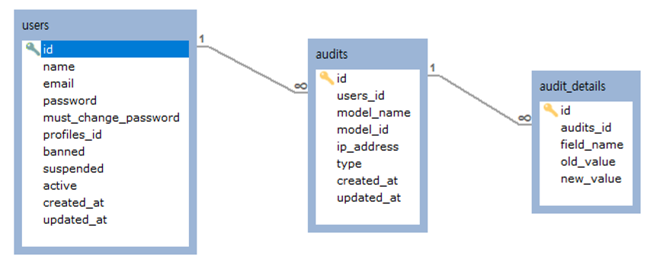

# Parrot

This package is **Blameable Audit Utility** for Phalcon 4.0.  
this package was written based on [phalcon/incubator](https://github.com/phalcon/incubator).  
The difference between parrot and the phalcon/incubator is:  
* add *model_id*(integer) to *Audits* model   
* change *user_name*(string) to *user_id*(integer) in *Audits* model.  

  

<br />

## Installation  
----
### Setup  

First, you need to setup composer:

* add `cppis/parrot` **repository(https://github.com/cppis/parrot)**  
```
"repositories": [
    {
        "name": "cppis/parrot",
        "type": "git",
        "url": "https://github.com/cppis/parrot"
    }
],
```

> **Parrot** was not registered to packagist.org.  
> So you need to register package repo manually.

<br />

* add `cppis/parrot` to **require**  
```
"require-dev": {
    "cppis/parrot": "^0.1"
},
```

<br /><br />

### Getting Started  

Now, you need to add code to Model::initialize mehtod:
  
```
class MyModel extends Model
{
    public function initialize()
    {
        ...

        $this->keepSnapshots(true);
        
        $this->setup([
            'notNullValidations' => false
        ]);
        
        $this->hasMany('id', Audits::class, 'users_id', [
            'alias'      => 'audits',
            'foreignKey' => [
                'action' => Relation::ACTION_CASCADE,
                'message' => 'User cannot be deleted because he/she has activity in the system',
            ],
        ]);
        
        $this->addBehavior(new Blameable([
            'snapshotUpdatingDisabled' => true,
            'auditClass'       => Audits::class,
            'auditDetailClass' => AuditDetails::class,
            'userCallback' => function (DiInterface $di) {
                $auth   = $di->getShared('auth');
                return $auth->getUser()->id;
            },
        ]));
    }
}
```

<br />

Let me explain the code above:

#### Keep the record snapshot  
```
$this->keepSnapshots(true);
```

*protected keepSnapshots (mixed $keepSnapshot)*

*keepSnapshots* method sets if the model must keep the original record snapshot in memory.
we use this setting because need old and new values.  

<br />

#### Not Null Validations   
```
$this->setup([
    'notNullValidations' => false
]);
```

The ORM automatically validate the not null columns present in the mapped table

<br />

#### Define Relationships     
```
$this->hasMany('id', Audits::class, 'users_id', [
    'alias'      => 'audits',
    'foreignKey' => [
        'action' => Relation::ACTION_CASCADE,
        'message' => 'User cannot be deleted because he/she has activity in the system',
    ],
]);
```

<br />

#### Define Blameable     
```
$this->addBehavior(new Blameable([
    'snapshotUpdatingDisabled' => true,
    'auditClass'       => Audits::class,
    'auditDetailClass' => AuditDetails::class,
    'userCallback' => function (DiInterface $di) {
        $auth   = $di->getShared('auth');
        return $auth->getUser()->id;
    },
]));
```

<br /><br /><br />

## Reference
----
* [phalcon/incubator](https://github.com/phalcon/incubator/tree/4.0.x)  
